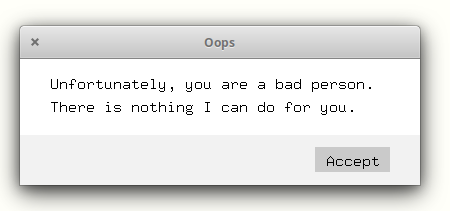

This is a lightweight message box  project, using only X11 for rendering, which is very useful if you want to avoid external dependencies on your projects. The function is designed to give you flexibility. And you can easily customize the output by changing the source code.

  

